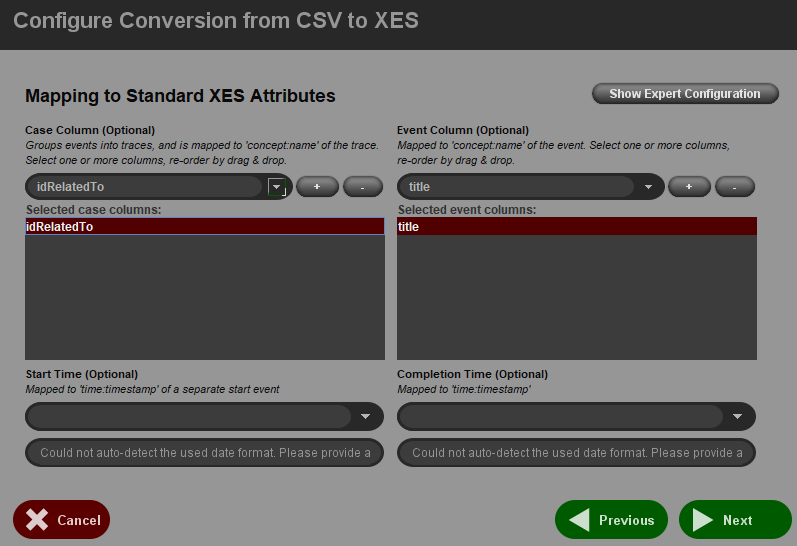
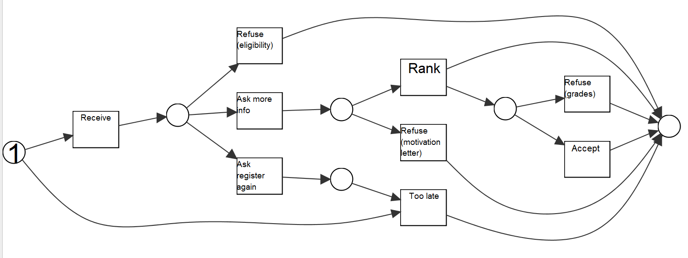
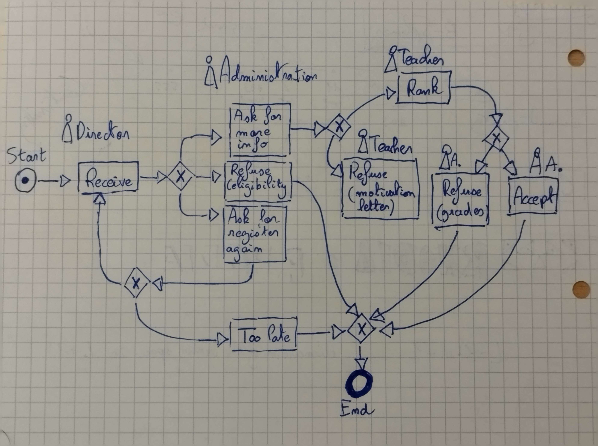

# Process Mining Experiment

This program produces random Event Logs based on business rules.

## How we built it and purpose

1) We specified concurrent rules of an end-to-end process and drawn a Process Model
2) We implemented the rules in the Go programming language
3) The Event Logs produced can be given to Process Mining tools and Process Mining algorithm for testing and experiments purposes

## Run

1) An executable file is already compiled for Windows 64 bits.

2) Otherwise, requires [golang](https://go.dev/) installed.

Run the program
> `go run .`

Compile the code into an executable
> `go build`

## Use the [open source ProM tool](https://promtools.org/) to generate a Process Model

1) Import or drag-and-drop the CSV Event Log generated into ProM
2) Convert it into the XES format specifying which property is the Case Column (to identify students) and which property is the Event Column (to identify tasks)

3) With the XES file, use a Discovery Algorithm, Alpha Miner works just fine and should generate a rather close Process Model 

## Functionality

The program generate randomly an Event Log in both `JSON` and `CSV` format (JSON is easier to read and CSV can be used for the [open source ProM tool](https://promtools.org/)).
The Event Log represent **1 single process** containing **9 activities** for **100 actors**, here, actors are students.
The number of students (`nbStudents`) can be changed.
The number of logs is variant because there's randomness in the generation process. 

- `Activities` are identified by the property `title`
- `Actors` (here students) are identified by the property `idRelatedTo`
- `Logs` contains each a timestamp,
    - the property `timestamp` is used for the internal program to handle concurrency
    - the property `date` is a timestamp in the ISO date format

## Rules

### A university receive student applications.

There's three roles in the university:
- The **Director** who receive the candidatures
- The **Administration** who decide wether to accept or not students in several steps in the process
- The **Teachers** who give grades to students for ranking them and accept only the best students 

### The 9 tasks for the process:

*Drawn process model before implementing it*

1) **Receive** *Director*
First a Student send a registration to the university, on the point of view of the university, the director receive and read it.

2) **Ask for more info** *Administration*
The student matches the criteria so the administration can send him or her an email asking for more information, for example, project works and motivation letter.

3) **Refuse (eligibility)** *Administration*
The student can not be enrolled into the university, e.g. he or she is not graduated enough.

4) **Ask for register again** *Administration*
The student didn't give enough information, he or she need to send it again before the deadline.

5) **Refuse (motivation letter)** *Teacher*
Whenever the student that has been asked for give more information sends the information, a teacher read the provided documents and decide the student isn't qualified enough for study in the university. The student is therefore refused.

6) **Rank** *Teacher*
Whenever the student that has been asked for give more information sends the information, a teacher read the provided documents, decide that the student has sufficient skills to be enrolled into the university, and assign him or her a grade in order to rank the student.

7) **Refuse (grades)** *Administration*
Once the deadline is reached, it's time to choose a certain amount (here in the code a certain proportion) of students regarding to their assigned grade. This task tell the student he or she has been refused.

8) **Accept** *Administration*
Once the deadline is reached, it's time to choose a certain amount (here in the code a certain proportion) of students regarding to their assigned grade. This task tell the student he or she has been accepted and is enrolled in the université.

9) **Too late** *Administration
Once the deadline is reached, administrators tell all students that are not refused or accepted yet that it is now too late to enroll.*

## GoLang

We used Go programming language to implement this program. Go is both easy to use and powerful for handling concurrency.